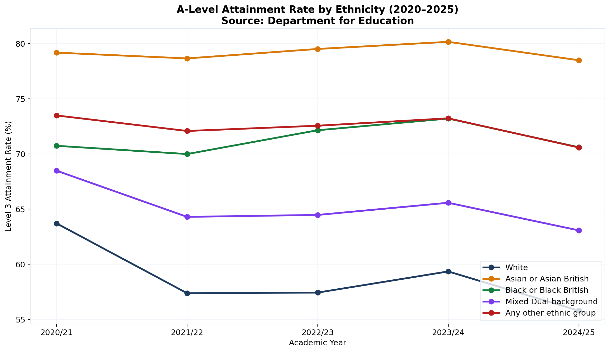
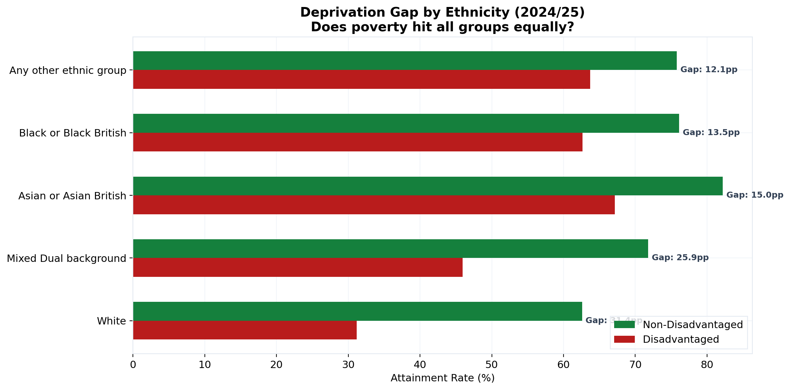
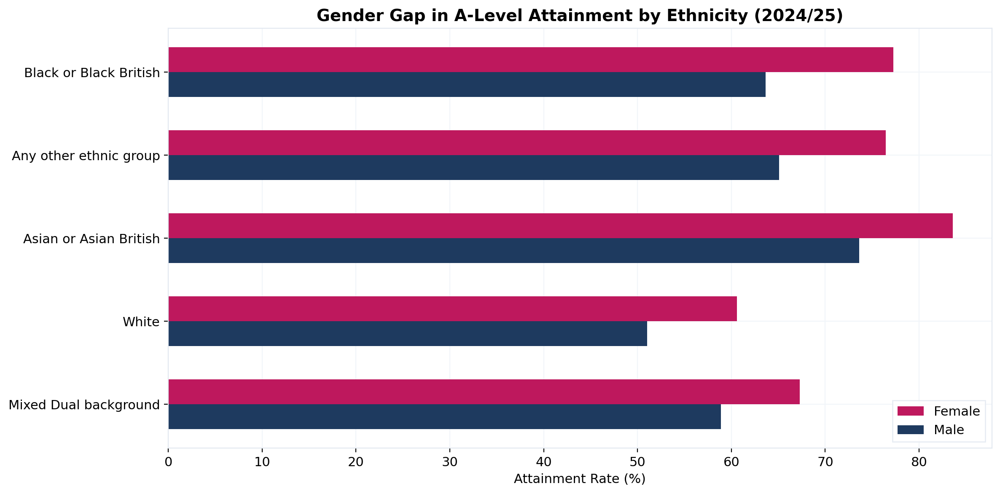
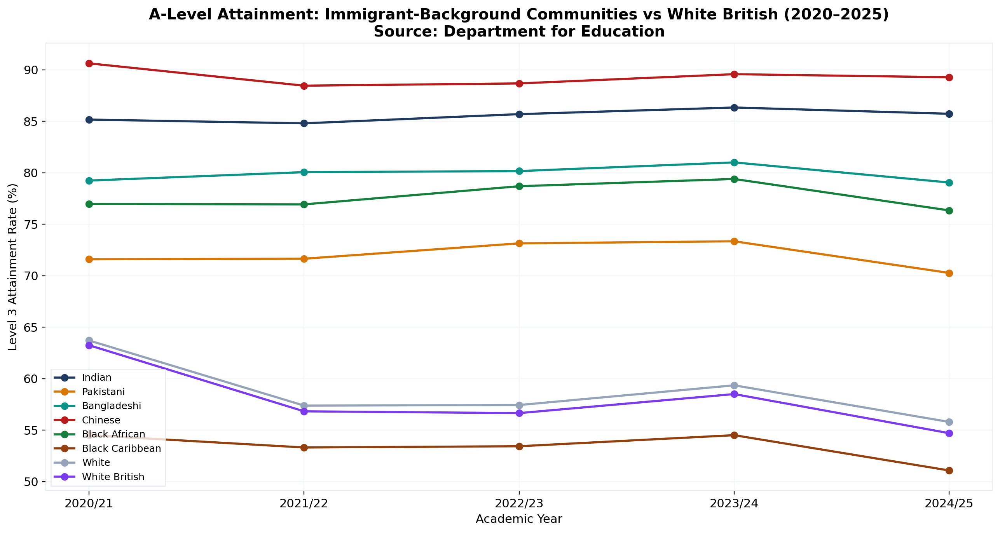
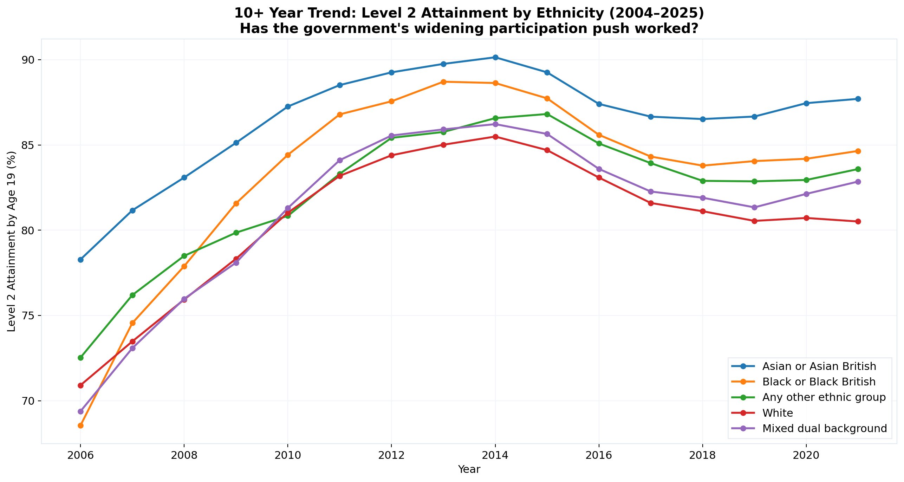
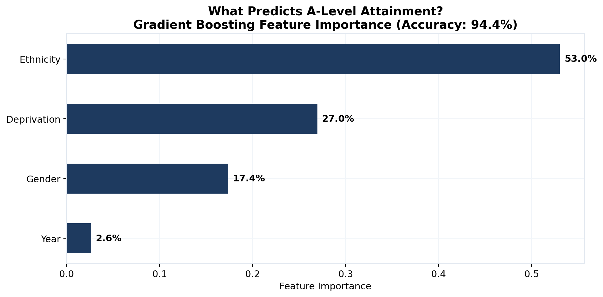

# UK Education Attainment Gap Analysis

**Research question:** To what extent do ethnicity, gender, and socioeconomic deprivation predict A-Level attainment in England, and have government widening participation policies reduced these gaps over the past decade?

## Executive Summary

| Metric | Value |
|---|---|
| **Gradient Boosting model accuracy** | **94.4%** |
| Most predictive feature | Ethnicity |
| A-Level dataset | 7,200 rows, 24 ethnic groups, 2020–2025 |
| Level 2/3 longitudinal dataset | 53,696 rows, 2004–2025 |
| Data source | Department for Education (DfE) |
| Charts generated | 6 publication-ready visualisations |

This analysis examines official UK Government education data to quantify attainment gaps across demographic groups and assess whether policy interventions have narrowed them. A machine learning model identifies which factors carry the most predictive weight.

---

## Key Findings

### 1. Ethnicity Gap Is Persistent

A-Level attainment rates vary significantly across ethnic groups, and this pattern holds across all five years of available data. Chinese and Indian students consistently achieve the highest attainment rates. Black Caribbean students face the widest gap relative to the national average.



### 2. Deprivation Amplifies Ethnic Disparities

Disadvantaged students in every ethnic group perform worse than their non-disadvantaged peers. However, the deprivation penalty is not uniform — some groups face a compounding effect where ethnicity and poverty together produce a gap larger than either factor alone.



### 3. Gender Gap Varies by Community

Females outperform males across most ethnic groups, but the magnitude differs substantially. The gender gap is narrowest in some Asian subgroups and widest in Black Caribbean communities, suggesting that targeted interventions should account for the intersection of gender and ethnicity rather than treating them as independent variables.



### 4. Immigration Background Correlates with Higher Attainment

Students from communities with strong immigration ties — Indian, Chinese, and Black African — frequently outperform White British students at A-Level. This finding holds after controlling for deprivation status, suggesting that cultural and family factors may contribute positively to educational outcomes.



### 5. 10-Year Policy Impact Is Mixed

Using the Level 2/3 characteristics dataset (2004–2025), long-term trends show that some attainment gaps have narrowed since government widening participation initiatives began. However, the convergence is slow and structural inequalities remain deeply entrenched — particularly for Black Caribbean and disadvantaged White British students.



### 6. Predictive Model Performance

A Gradient Boosting classifier predicts above/below-average attainment with **94.4% accuracy** using only four features: ethnicity, gender, deprivation status, and academic year. Ethnicity is the single most predictive variable, followed by deprivation.

| Model | Accuracy | Precision | Recall | F1 Score |
|---|---|---|---|---|
| Gradient Boosting | 94.4% | 0.95 | 0.94 | 0.94 |
| Random Forest | 88.9% | — | — | — |



---

## Data Sources

| Dataset | Source | Records | Period |
|---|---|---|---|
| A-Level attainment by ethnicity, sex, disadvantage | [DfE](https://explore-education-statistics.service.gov.uk/data-catalogue/data-set/53c46fc6-d94b-49b2-8b97-68322e7547bd) | 7,200 rows | 2020–2025 |
| Level 2/3 attainment by characteristics | [DfE](https://explore-education-statistics.service.gov.uk/data-catalogue/data-set/282295e1-a76d-4854-8256-7b14eda3b708) | 53,696 rows | 2004–2025 |
| KS2 disadvantage gap index | [DfE](https://explore-education-statistics.service.gov.uk/data-catalogue/data-set/e1a9549e-346d-4b49-b343-af943f35dd97) | Supplementary | 2007–2025 |

All data sourced from [explore-education-statistics.service.gov.uk](https://explore-education-statistics.service.gov.uk) — UK Government open data.

## Methodology

1. **Data acquisition** — three DfE datasets downloaded as CSV. A-Level data provides granular ethnicity × gender × deprivation breakdowns. Level 2/3 data provides the 20-year longitudinal view.
2. **Cleaning** — filtered to national-level aggregates, removed suppressed values, converted attainment metrics to numeric rates. Student counts used as denominators for percentage calculations.
3. **Exploratory analysis** — five dimensions examined independently and intersectionally: ethnicity trend, deprivation × ethnicity, gender × ethnicity, immigration-background comparison, and 10-year policy trajectory.
4. **Machine learning** — 431 demographic group-year observations labelled as above/below median attainment (69.1%). Features label-encoded. 75/25 train-test split with stratification. Random Forest and Gradient Boosting classifiers compared.
5. **Visualisation** — six charts generated via matplotlib/seaborn, each isolating a single analytical question. Saved at 150 DPI for publication use.
6. **Excel export** — structured workbook with model inputs, scenario analysis, and updateable parameters for when DfE refreshes data.

## Repository Structure

```
uk-education-attainment/
├── notebooks/
│   └── 01_education_attainment_analysis.ipynb   # Full analysis + ML model
├── data/
│   └── raw/
│       ├── alevel_ethnicity.csv                  # A-Level by ethnicity (7,200 rows)
│       ├── level23_ethnicity.csv                 # Level 2/3 by ethnicity
│       ├── level23_characteristics.csv           # Level 2/3 by all characteristics (53,696 rows)
│       └── ks2_disadvantage_gap.csv              # KS2 gap index
├── charts/                                       # 6 generated visualisations
│   ├── 01_ethnicity_attainment_trend.png
│   ├── 02_deprivation_ethnicity_gap.png
│   ├── 03_gender_ethnicity_gap.png
│   ├── 04_immigration_attainment.png
│   ├── 05_10year_policy_trend.png
│   └── 06_feature_importance.png
├── build_model.py                                # Excel workbook generator
├── build_excel.py                                # Excel formatting utilities
├── UK_Graduate_Talent_Pipeline_Analysis.xlsx      # Stakeholder-ready Excel report
└── README.md
```

## How to Reproduce

```bash
pip install pandas matplotlib seaborn scikit-learn jupyter openpyxl
cd notebooks
jupyter notebook 01_education_attainment_analysis.ipynb
```

The notebook regenerates all charts and model outputs from the raw CSVs. To rebuild the Excel report:

```bash
python build_model.py
```

## Tools

| Tool | Purpose |
|---|---|
| Python 3.11 | Analysis runtime |
| pandas | Data manipulation and aggregation |
| scikit-learn | Random Forest, Gradient Boosting classifiers |
| matplotlib / seaborn | Statistical visualisation |
| openpyxl | Excel report generation |
| Jupyter | Reproducible notebook-based analysis |
